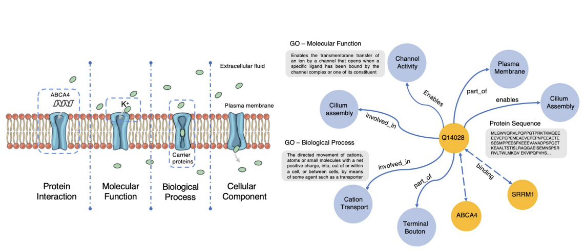
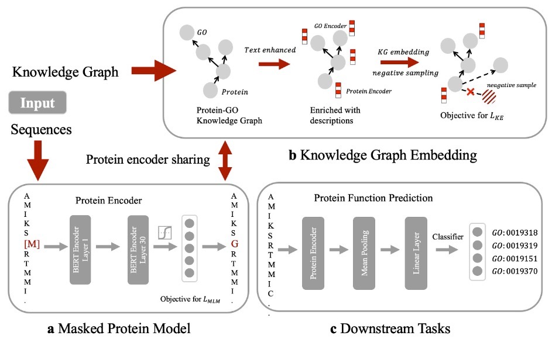
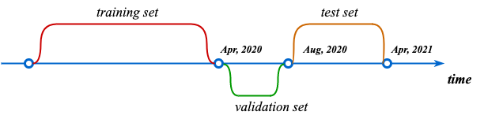

# OntoProtein

This is the implement of the paper "[OntoProtein: Protein Pretraining With Ontology Embedding](https://arxiv.org/pdf/2201.11147.pdf)". OntoProtein is an effective method that make use of structure in GO (Gene Ontology) into text-enhanced protein pre-training model.

<div align=center></div>

## Quick links

* [Overview](#overview)
* [Requirements](#requirements)
  * [Environment for pre-training data generation](#environment-for-pre-training-data-generation)
  * [Environmen for OntoProtein pre-training](#environment-for-ontoprotein-pre-training)
  * [Environment for protein-related tasks](#environment-for-protein-related-tasks)
* [Data preparation](#data-preparation)
  * [Pre-training data](#pre-training-data)
  * [Downstream task data](#downstream-task-data)
* [Protein pre-training model](#protein-pre-training-model)
* [Usage for protein-related tasks](#usage-for-protein-related-tasks)
* [Citation](#citation)

## Overview
<span id="overview"></span>

In this work we present OntoProtein, a knowledge-enhanced protein language model that jointly optimize the KE and MLM objectives, which bring excellent improvements to a wide range of protein tasks. And we introduce **ProteinKG25**, a new large-scale KG dataset, promting the research on protein language pre-training.

<div align=center></div>

## Requirements
<span id="requirements"></span>
To run our code, please install dependency packages for related steps.

### Environment for pre-training data generation
<span id="environment-for-pre-training-data-generation"></span>
python3.8 / biopython 1.37 / goatools

### Environment for OntoProtein pre-training
<span id="environment-for-ontoprotein-pre-training"></span>
python3.8 / pytorch 1.9 / transformer 4.5.1+ / deepspeed 0.5.1/ lmdb / 

### Environment for protein-related tasks
<span id="environment-for-protein-related-tasks"></span>
python3.8 / pytorch 1.9 / transformer 4.5.1+ / lmdb

**Note:** environments configurations of some baseline models or methods in our experiments, e.g. BLAST, DeepGraphGO, we provide related links to configurate as follows:

[BLAST](https://www.ncbi.nlm.nih.gov/books/NBK569861/) / [Interproscan](https://github.com/ebi-pf-team/interproscan) / [DeepGraphGO](https://github.com/yourh/DeepGraphGO) / [GNN-PPI](https://github.com/lvguofeng/GNN_PPI)

## Data preparation
<span id="data-preparation"></span>
For pretraining OntoProtein, fine-tuning on protein-related tasks and inference, we provide acquirement approach of related data.

### Pre-training data
<span id="pre-training-data"></span>
To incorporate Gene Ontology knowledge into language models and train OntoProtein, we construct [ProteinKG25](https://zjunlp.github.io/project/ProteinKG25/), a large-scale KG dataset with aligned descriptions and protein sequences respectively to GO terms and protein entities. There have two approach to acquire the pre-training data: 1) download our prepared data **ProteinKG25**, 2) generate your own pre-training data.



#### Download released data

We have released our prepared data **ProteinKG25** in [Google Drive](https://drive.google.com/file/d/1iTC2-zbvYZCDhWM_wxRufCvV6vvPk8HR/view).

The whole compressed package includes following files:

- `go_def.txt`: GO term definition, which is text data. We concatenate GO term name and corresponding definition by colon.
- `go_type.txt`: The ontology type which the specific GO term belong to. The index is correponding to GO ID in `go2id.txt` file.
- `go2id.txt`: The ID mapping of GO terms.
- `go_go_triplet.txt`: GO-GO triplet data. The triplet data constitutes the interior structure of Gene Ontology. The data format is < `h r t`>, where `h` and `t` are respectively head entity and tail entity, both GO term nodes. `r` is relation between two GO terms, e.g. `is_a` and `part_of`.
- `protein_seq.txt`: Protein sequence data. The whole protein sequence data are used as inputs in MLM module and protein representations in KE module.
- `protein2id.txt`: The ID mapping of proteins.
- `protein_go_train_triplet.txt`: Protein-GO triplet data. The triplet data constitutes the exterior structure of Gene Ontology, i.e. Gene annotation. The data format is <`h r t`>, where `h` and `t` are respectively head entity and tail entity. It is different from GO-GO triplet that a triplet in Protein-GO triplet means a specific gene annotation, where the head entity is a specific protein and tail entity is the corresponding GO term, e.g. protein binding function. `r` is relation between the protein and GO term.
- `relation2id.txt`:  The ID mapping of relations. We mix relations in two triplet relation.

#### Generate your own pre-training data

For generating your own pre-training data, you need download following raw data:

- `go.obo`: the structure data of Gene Ontology. The download link and detailed format see in [Gene Ontology](http://geneontology.org/docs/download-ontology/)`
- `uniprot_sprot.dat`: protein Swiss-Prot database. [[link]](https://www.uniprot.org/downloads)
- `goa_uniprot_all.gpa`: Gene Annotation data. [[link]](https://ftp.ebi.ac.uk/pub/databases/GO/goa/old/UNIPROT/)

When download these raw data, you can excute following script to generate pre-training data:

```bash
python tools/gen_onto_protein_data.py
```

### Downstream task data
<span id="downstream-task-data"></span>
Our experiments involved with several protein-related downstream tasks. [[Download datasets]](https://drive.google.com/file/d/12d5wzNcuPxPyW8KIzwmvGg2dOKo0K0ag/view?usp=sharing)

## Protein pre-training model
<span id="protein-pre-training-model"></span>
You can pre-training your own OntoProtein based above pretraining dataset. Before pretraining OntoProtein, you need to download two pretrained model, respectively [ProtBERT](https://huggingface.co/Rostlab/prot_bert) and [PubMedBERT](https://huggingface.co/microsoft/BiomedNLP-PubMedBERT-base-uncased-abstract-fulltext) and save them in `data/model_data/ProtBERT` and `data/model_data/PubMedBERT`. We provide the script `bash script/run_pretrain.sh` to run pre-training. And the detailed arguments are all listed in `src/training_args.py`, you can set pre-training hyperparameters to your  need.

## Usage for protein-related tasks
<span id="usage-for-protein-related-tasks"></span>

We have released the checkpoint of pretrained model on the model library of `Hugging Face`. [[Download model]](https://huggingface.co/zjukg/OntoProtein).

### Running examples

The shell files of training and evaluation for every task are provided in `script/` , and could directly run.

Also, you can utilize the running codes `run_downstream.py` , and write your shell files according to your need:

- `run_downstream.py`: support `{ss3, ss8, contact, remote_homology, fluorescence, stability}` tasks;

#### Training models

Running shell files: `bash script/run_{task}.sh`, and the contents of shell files are as follow:

```shell
sh run_main.sh \
    --model ./model/ss3/ProtBertModel \
    --output_file ss3-ProtBert \
    --task_name ss3 \
    --do_train True \
    --epoch 5 \
    --optimizer AdamW \
    --per_device_batch_size 2 \
    --gradient_accumulation_steps 8 \
    --eval_step 100 \
    --eval_batchsize 4 \
    --warmup_ratio 0.08 \
    --frozen_bert False
```

You can set more detailed parameters in run_main.sh. The details of main.sh are as follows:

```shell
LR=3e-5
SEED=3
DATA_DIR=data/datasets
OUTPUT_DIR=data/output_data/$TASK_NAME-$SEED-$OI

python run_downstream.py \
  --task_name $TASK_NAME \
  --data_dir $DATA_DIR \
  --do_train $DO_TRAIN \
  --do_predict True \
  --model_name_or_path $MODEL \
  --per_device_train_batch_size $BS \
  --per_device_eval_batch_size $EB \
  --gradient_accumulation_steps $GS \
  --learning_rate $LR \
  --num_train_epochs $EPOCHS \
  --warmup_ratio $WR \
  --logging_steps $ES \
  --eval_steps $ES \
  --output_dir $OUTPUT_DIR \
  --seed $SEED \
  --optimizer $OPTIMIZER \
  --frozen_bert $FROZEN_BERT \
  --mean_output $MEAN_OUTPUT \

```

**Notice: the best checkpoint is saved in** `OUTPUT_DIR/`.

## How to Cite
```
@article{zhang2022ontoprotein,
  title={OntoProtein: Protein Pretraining With Gene Ontology Embedding},
  author={Zhang, Ningyu and Bi, Zhen and Liang, Xiaozhuan and Cheng, Siyuan and Hong, Haosen and Deng, Shumin and Lian, Jiazhang and Zhang, Qiang and Chen, Huajun},
  journal={arXiv preprint arXiv:2201.11147},
  year={2022}
}
```
